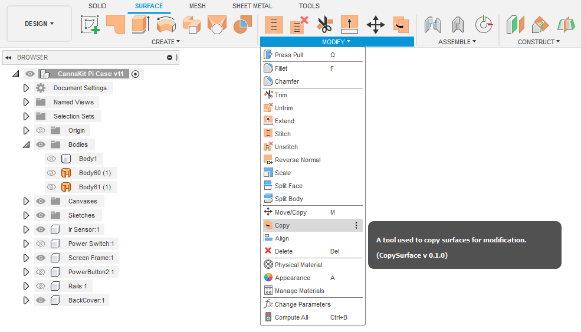
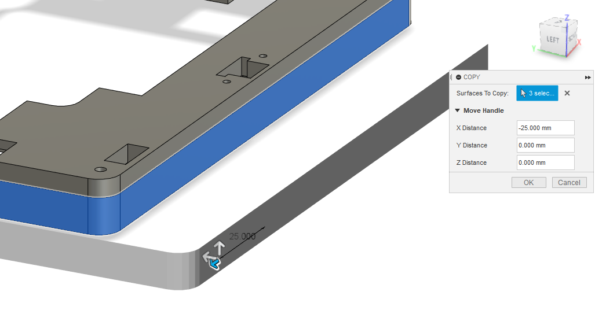
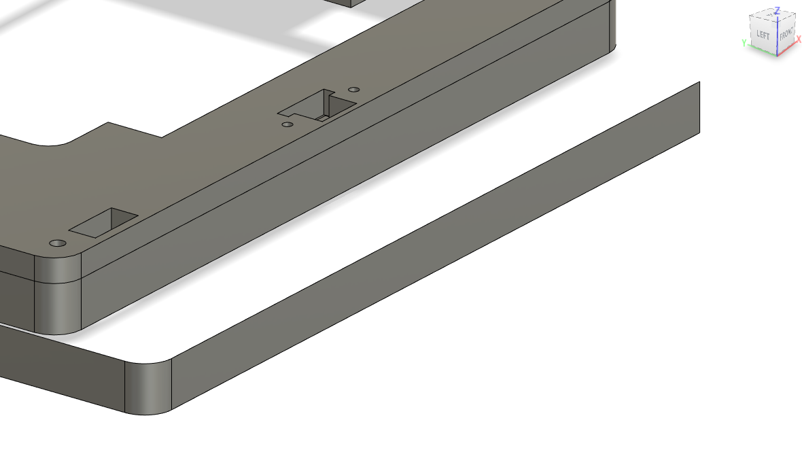

#  SurfaceCopy 

SurfaceCopy is an Autodesk® Fusion 360™ add-in that allows the copying and relocation of most surfaces while providing a low-lag preview. This command primarily focuses on streamlining the process of replecating a surface, and thus the translation tool is barebones and should be used in tandem with Fusion's built-in move tool.

SurfaceCopy is free, but if you particually like it and wish to see more, consider [buying me a coffee (Ko-fi link)](ko-fi.com/zxynine)

## Features
### -Current:
* Copy multiple surfaces at once
* Integrated move command for copied surfaces
* Custom graphics preview cuts back on performance hit while reloacting copies.
* Parametic Mode: Groups actions in timeline

### -Planned:
* Option to patch copied surfaces (currently creates each surface as its own object)
* Integrate rotation into the move handle
* Option to copy material of original surface (Currently just default grey)
* Better method of displaying a preview which will further cut back on any performance issues

Note: I am just a single uni student so updates are not scheduled and issues may take me quite some time to fix, please be patient!

## Usage
1. When enabled, the add-in creates a new command under ***`Design(Workspace)`->`Surface(Tab)`->`Modify(Panel)`->`Copy`*** as seen in the screenshot below.

 

2. After launching the command, you will need to select any faces/surfaces you wish to have copied.
3. Any selections will activate a handle at the location you first click, which you can use to relocate the copies along the X, Y, and Z axes.
4. When you are satisfied, hit `OK` and the surfaces will be created for you.

 

 

## Supported Platforms
  * Windows
  * Mac OS*

\* *Code should be universial, however, testing has only been done thoroughly on Windows 10 64bit. (Its all I have)*

## Installation
1. Download the add-in from the [Releases](https://github.com/zxynine/SurfaceCopy/releases) page. If there are folders with an `@` symbol, ensure they are included in the release.
2. Unpack it into `API\AddIns` (see [How to install an add-in or script in Fusion 360](https://knowledge.autodesk.com/support/fusion-360/troubleshooting/caas/sfdcarticles/sfdcarticles/How-to-install-an-ADD-IN-and-Script-in-Fusion-360.html)).
3. Make sure the directory is named `AnyMacro`, with no suffix.
4. The new command ***`Design(Workspace)`->`Surface(Tab)`->`Modify(Panel)`->`Copy`*** should now be available.

The add-in can be temporarily disabled using the *Scripts and Add-ins* dialog. Press *`Shift+S`* in Fusion 360™ and go to the *Add-Ins* tab.

## Reporting Issues
If you get any problems, please check out the section on [Fusion 360 quirks](##fusion-360-quirks).

If that does not apply to you, please report any issues that you find in the add-in on the [Issues](https://github.com/zxynine/SurfaceCopy/issues) page.

For better support, please include the steps you performed and the result. Also include copies of any error messages.

## Fusion 360 Quirks
Be aware of the following quirks in Fusion 360™.

-Could not copy a surface
>Fusion 360™ may not be able to copy all surfaces. This addin uses the "OffsetFeature" in fusion to copy surfaces and some troublesome surfaces may "have boundary edges that are too complex for an extend to work" ([potential bug?](https://forums.autodesk.com/t5/fusion-360-design-validate/copy-a-face/m-p/5419629/highlight/true#M14011)).

-Copying/Moving complex or large numbers of surfaces is painfully slow
>Every time you are changing the distance or selecting new faces, the visuals you see need to be recreated from scratch and moved. This will cause a large performance decrease as the number of surfaces goes up. A feature is planed that will allow you to toggle whether or not the preview is displayed, and may provide additional methods of visualisation that are not so graphically taxing.

>Additionaly, I am working on an alternative method which may remove the need to constantly re-create each object on a changed input entierly.

## Changelog
* v 1.0.0
  * Original Implementation 

## Author
This add-in is created by [ZXYNINE](https://github.com/Zxynine) and published under [TION](https://apps.autodesk.com/en/Publisher/PublisherHomepage?ID=EFHWLR46R29G)

## License
This project is licensed under the terms of the MIT license. See [LICENSE](LICENSE).

## More Fusion 360™ Add-ins
[My Fusion 360™ app store page](https://apps.autodesk.com/en/Publisher/PublisherHomepage?ID=EFHWLR46R29G)

[All my add-ins on Github](https://github.com/Zxynine?tab=repositories)
